# 📊 프로젝트 아키텍처 다이어그램

이 문서는 뉴스 기반 주식 동향 분석 서비스의 전체 구조와 동작 방식을 시각적으로 설명합니다.

## 🏗 시스템 아키텍처

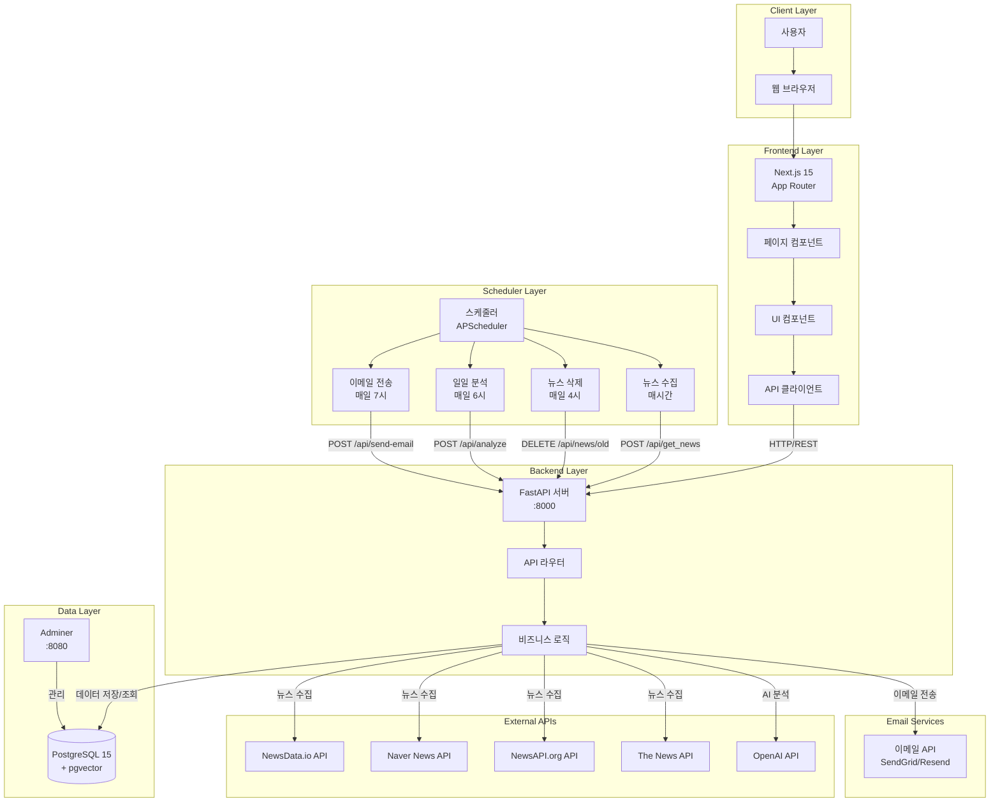

## 🔄 데이터 흐름도

### 1. 자동 뉴스 수집 플로우 (매시간)

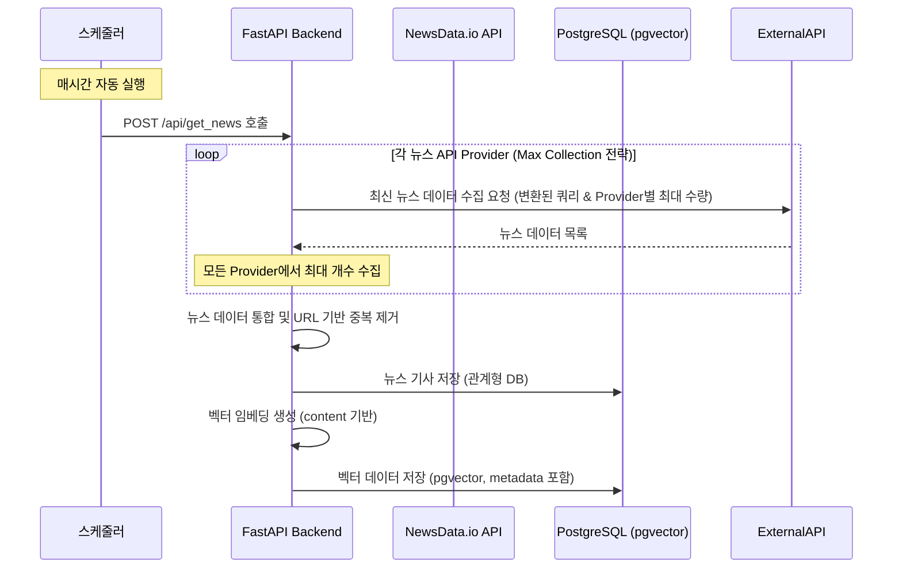

### 2. 자동 일일 분석 플로우 (매일 아침 6시)

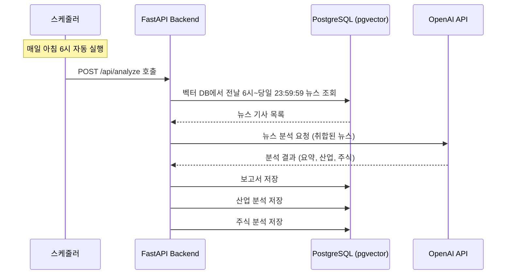

### 3. 이메일 전송 플로우 (매일 아침 7시)

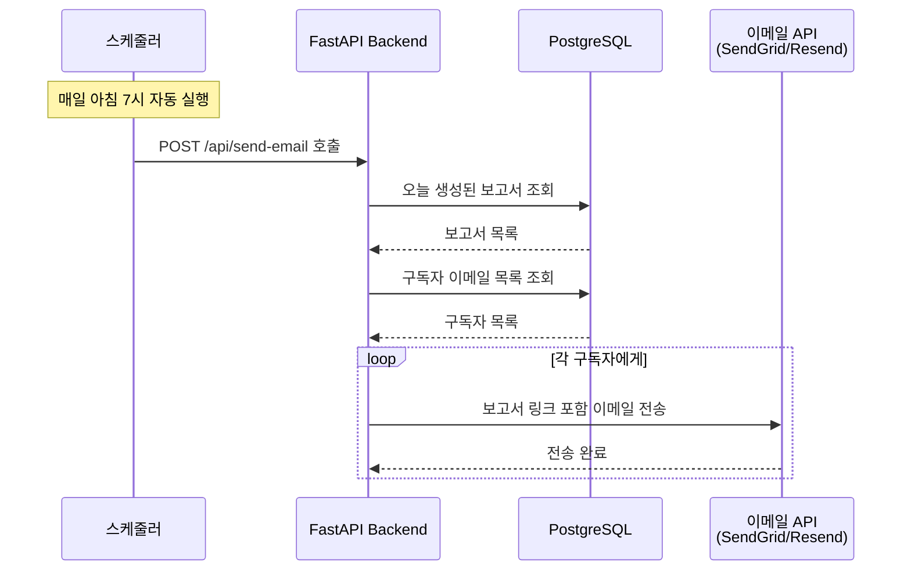

### 4. 보고서 조회 플로우

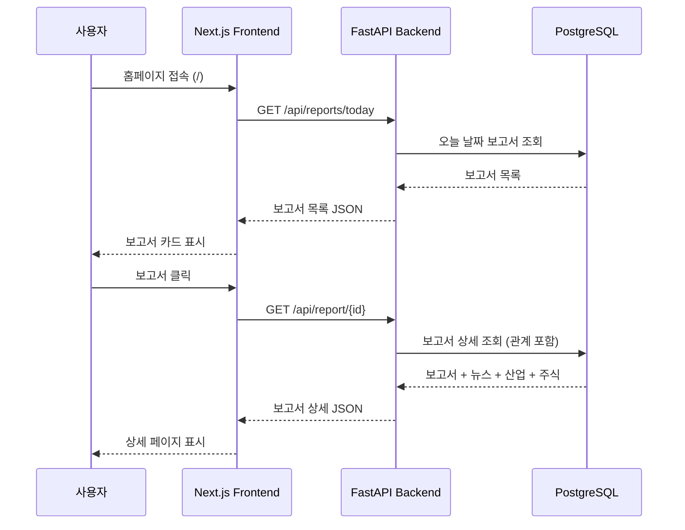

## 📡 API 엔드포인트 구조

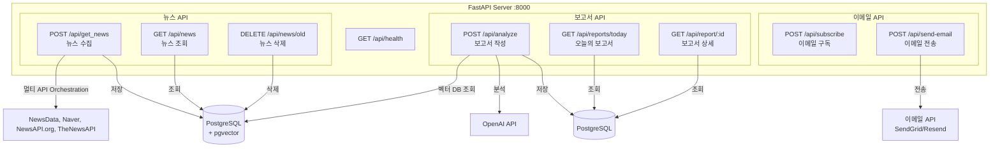

## 🗄 데이터베이스 스키마

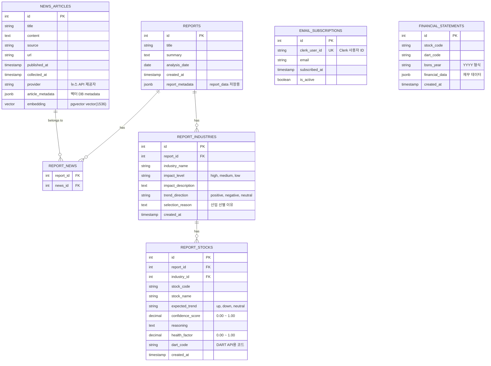

## 🔧 기술 스택 상세

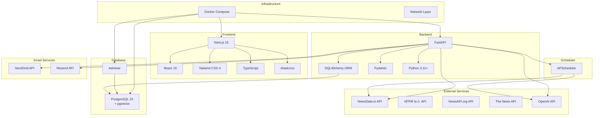

## 🌐 네트워크 아키텍처

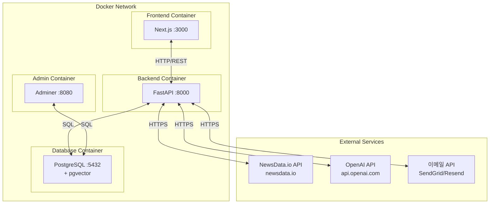

## 🔄 LangGraph 보고서 생성 플로우

### Graph Node 전체 흐름

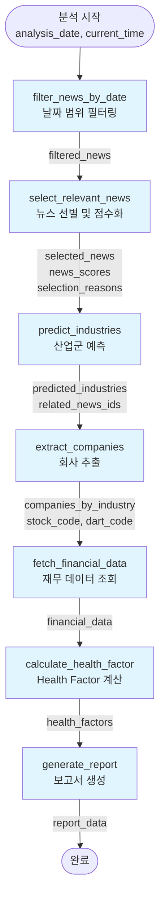

### 각 노드의 상세 로직

#### 1. filter_news_by_date
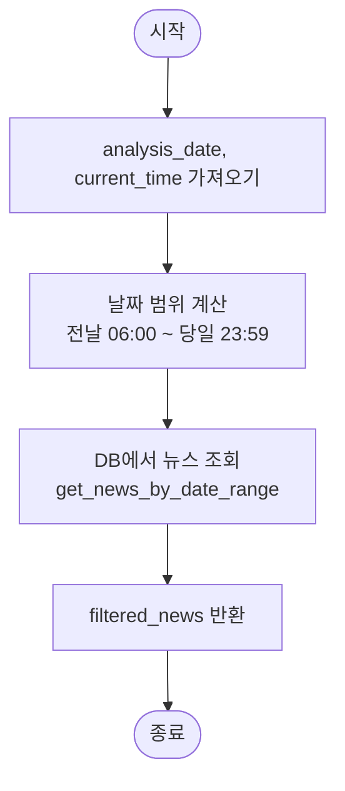

#### 2. select_relevant_news
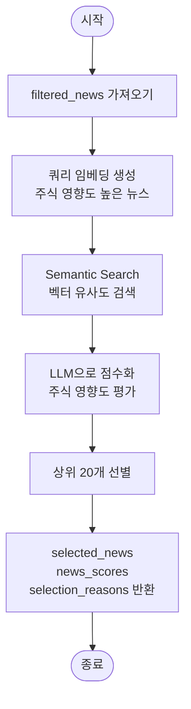

#### 3. predict_industries
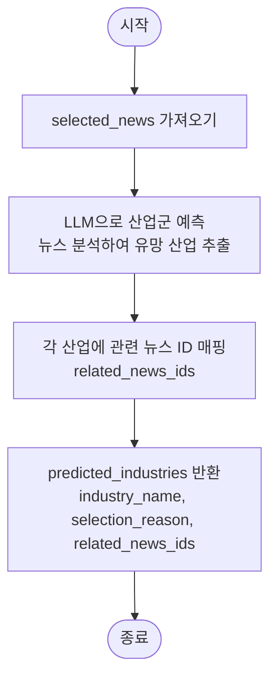

#### 4. extract_companies
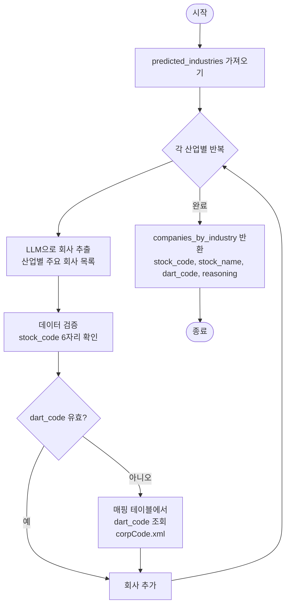

#### 5. fetch_financial_data
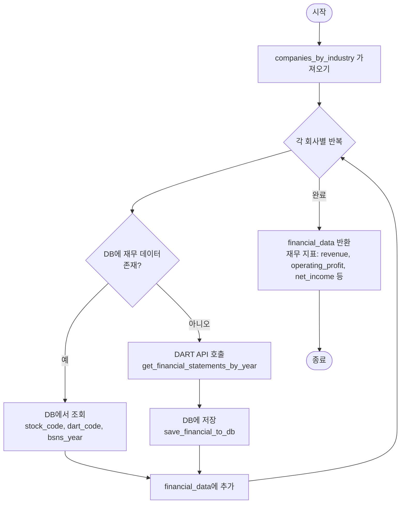

#### 6. calculate_health_factor
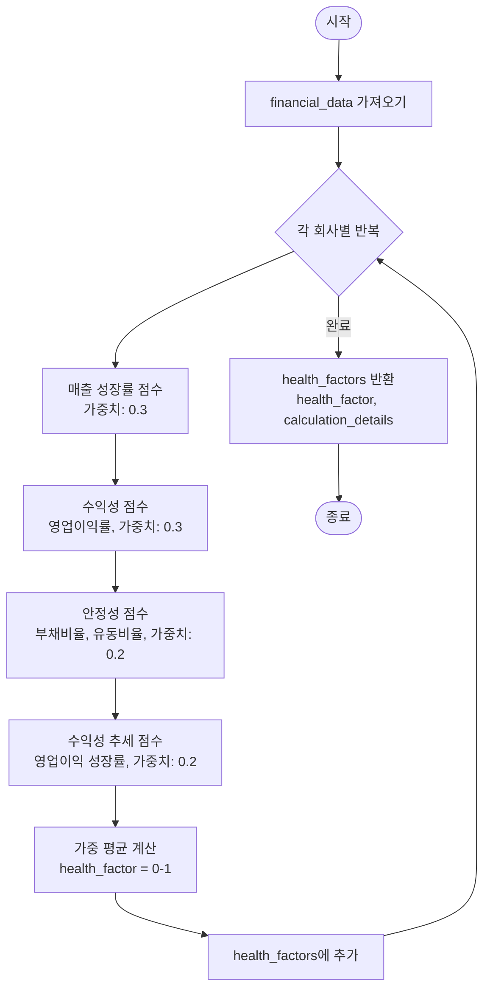

#### 7. generate_report
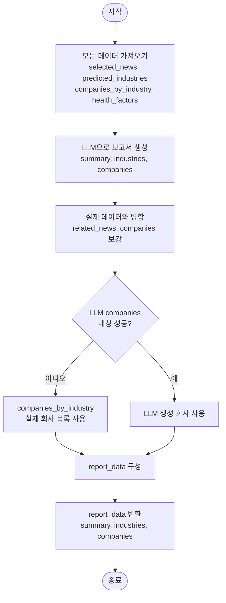

### State 데이터 흐름

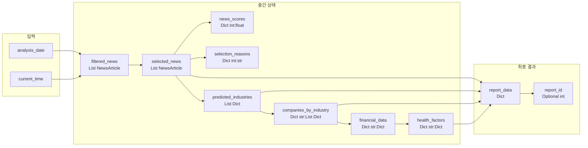

### 노드별 주요 기능 및 데이터 변환

| 노드 | 입력 | 출력 | 주요 기능 |
|------|------|------|----------|
| filter_news_by_date | analysis_date, current_time | filtered_news | 날짜 범위로 뉴스 필터링 (전날 6시 ~ 당일 23:59) |
| select_relevant_news | filtered_news | selected_news, news_scores, selection_reasons | Semantic Search + LLM으로 주식 영향도 높은 뉴스 선별 |
| predict_industries | selected_news | predicted_industries | LLM으로 뉴스 분석하여 유망 산업군 예측 |
| extract_companies | predicted_industries, selected_news | companies_by_industry | LLM으로 산업별 회사 추출 + dart_code 매핑 |
| fetch_financial_data | companies_by_industry | financial_data | DB 또는 DART API로 재무 데이터 조회 |
| calculate_health_factor | financial_data, companies_by_industry | health_factors | 재무 지표 기반 Health Factor 계산 |
| generate_report | selected_news, predicted_industries, companies_by_industry, health_factors | report_data | LLM으로 최종 보고서 생성 및 데이터 병합 |

---

**참고**: 이 다이어그램들은 Mermaid 문법으로 작성되었으며, GitHub, GitLab, 또는 Mermaid를 지원하는 마크다운 뷰어에서 렌더링됩니다.
