# 📊 프로젝트 아키텍처 다이어그램

이 문서는 뉴스 기반 주식 동향 분석 서비스의 전체 구조와 동작 방식을 시각적으로 설명합니다.

## 🏗 시스템 아키텍처

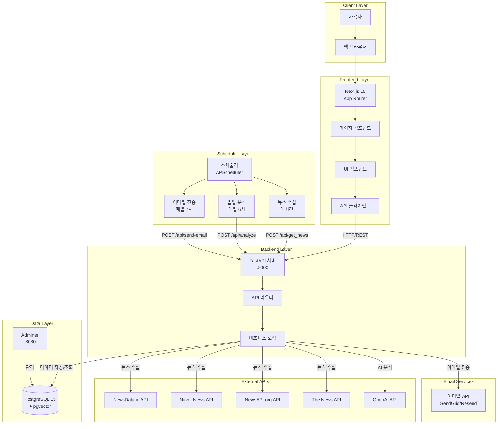

## 🔄 데이터 흐름도

### 1. 자동 뉴스 수집 플로우 (매시간)


### 2. 자동 일일 분석 플로우 (매일 아침 6시)

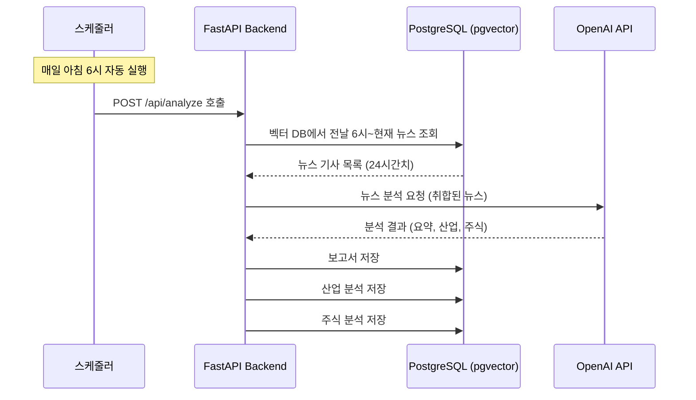

### 3. 수동 분석 요청 플로우 (선택사항)

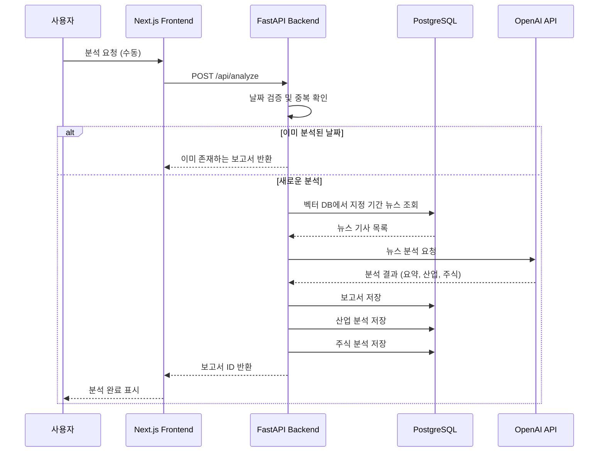

### 4. 이메일 전송 플로우 (매일 아침 7시)

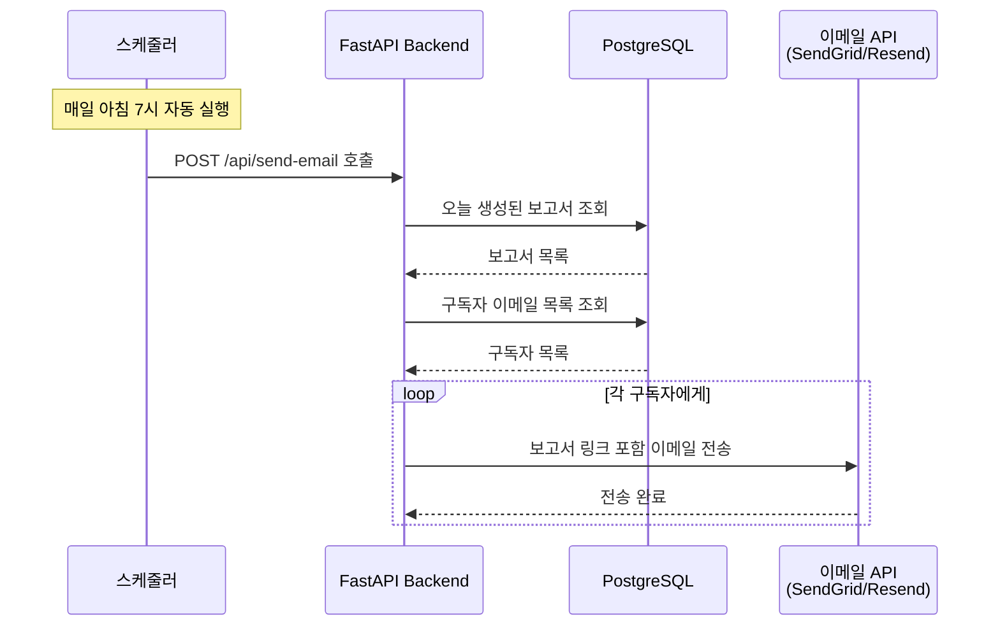

### 5. 보고서 조회 플로우

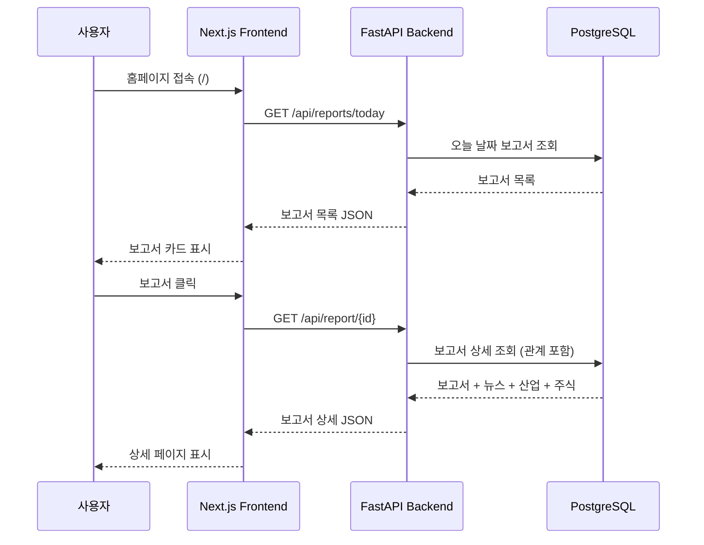

## 📡 API 엔드포인트 구조

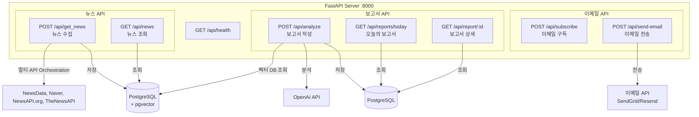

## 🗄 데이터베이스 스키마

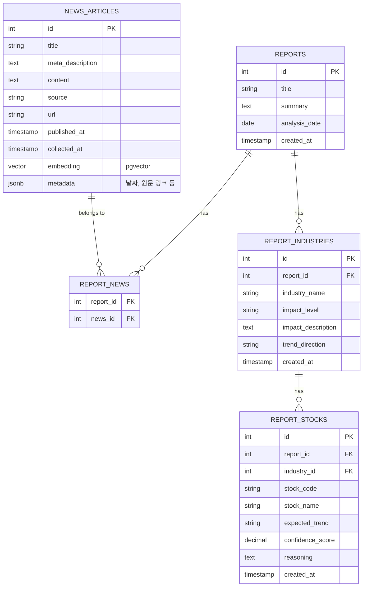

## 🎨 Frontend 컴포넌트 구조

```mermaid
graph TD
    subgraph "Pages"
        HomePage[/ - 홈페이지]
        ReportPage[/report/:id - 보고서 상세]
    end

    subgraph "Components"
        HeroSection[HeroSection<br/>Hero 섹션]
        TodayReports[TodayReports<br/>오늘의 보고서 목록]
        ReportCard[ReportCard<br/>보고서 카드]
        NewsList[NewsList<br/>뉴스 기사 리스트]
        IndustrySection[IndustrySection<br/>산업별 분석]
        StockCard[StockCard<br/>주식 카드]
    end

    subgraph "API Layer"
        ReportsAPI[lib/api/reports.ts<br/>- getTodayReports<br/>- getReport]
    end

    HomePage --> HeroSection
    HomePage --> TodayReports
    TodayReports --> ReportCard
    ReportPage --> NewsList
    ReportPage --> IndustrySection
    IndustrySection --> StockCard
    TodayReports --> ReportsAPI
    ReportPage --> ReportsAPI
```

## 🔧 기술 스택 상세

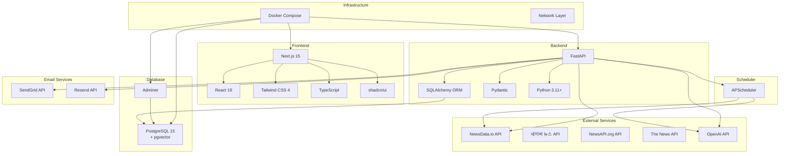

## 📋 주요 기능 플로우

### 자동 뉴스 수집 프로세스 (매시간)

```mermaid
flowchart TD
    Start([스케줄러: 매시간<br/>POST /api/get_news]) --> Orchestrate[Orchestration 설정]
    Orchestrate --> Split[쿼리 분리 및 OR 변환]
    Split --> LoopProviders{모든 Provider 시도?}
    
    LoopProviders -->|아니오| Fetch[API 호출 (Provider별 최대 수량)]
    Fetch --> Collect[결과 수집]
    Collect --> LoopProviders
    
    LoopProviders -->|예| Dedupe[URL 기반 중복 제거]
    Dedupe --> SaveNews[관계형 DB 저장]
    SaveNews --> Embedding[벡터 임베딩 생성]
    Embedding --> SaveVector[pgvector에 저장]
    SaveVector --> Success1[수집 완료]
    
    Success1 --> End([종료])
```

### 자동 일일 분석 프로세스 (매일 아침 6시)

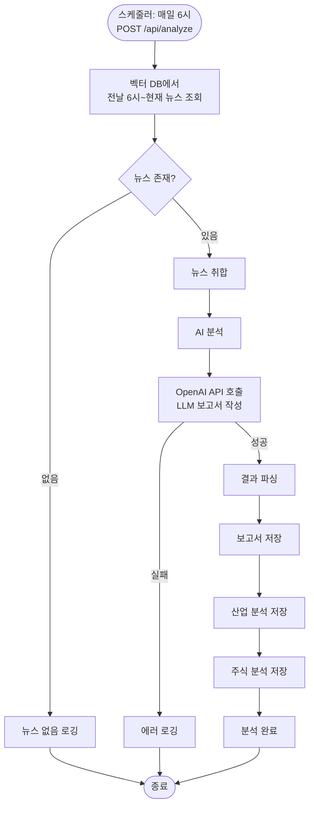

### 수동 분석 프로세스 (선택사항)

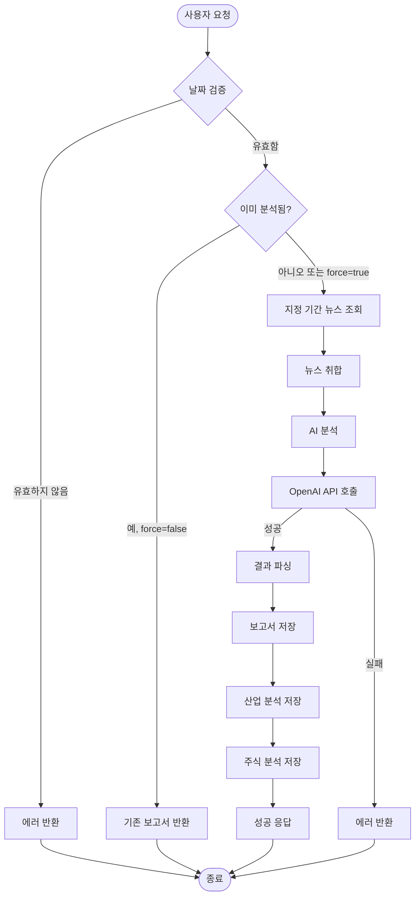

### 보고서 조회 프로세스

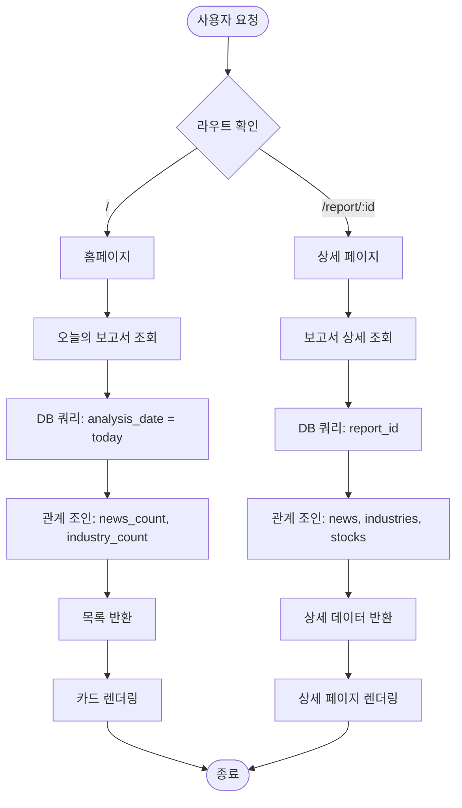

### 이메일 전송 프로세스 (매일 아침 7시)

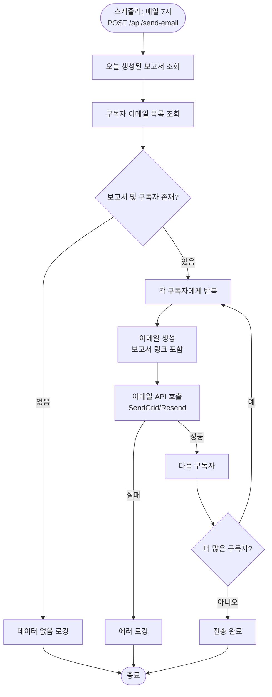

## 🌐 네트워크 아키텍처

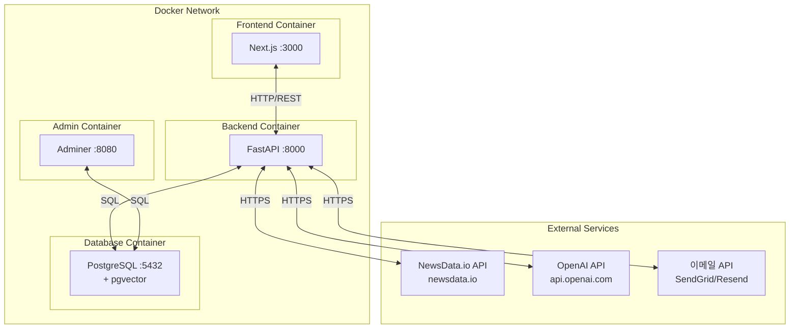

## 📦 컴포넌트 의존성

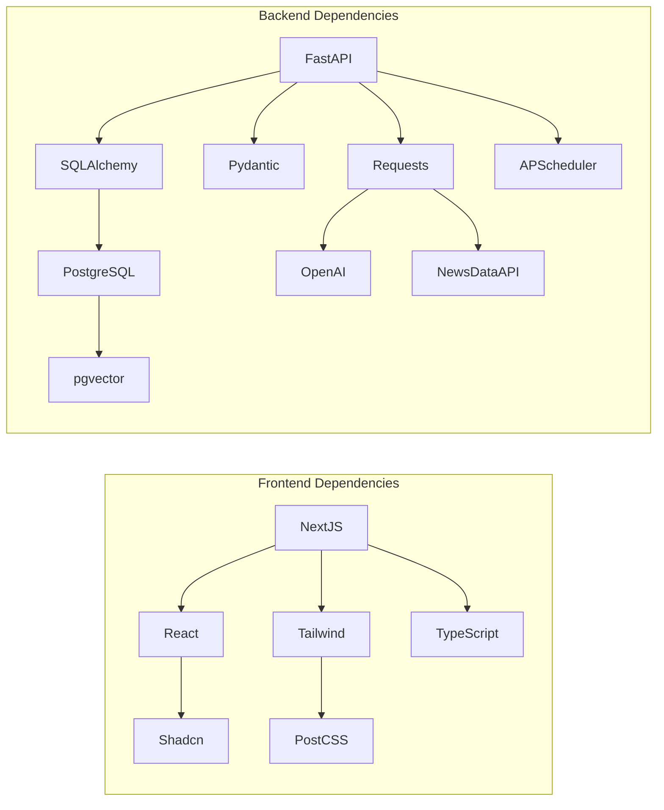

## 🚀 배포 아키텍처 (현재: 로컬 개발)

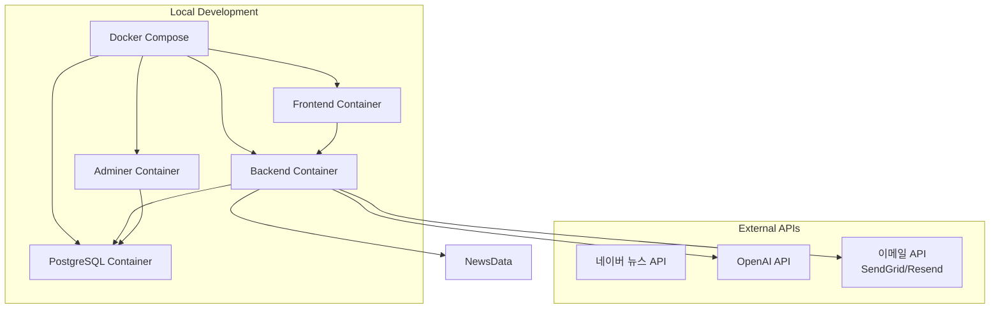

---

## 📝 다이어그램 설명

### 시스템 아키텍처

- 전체 시스템의 레이어 구조를 보여줍니다
- 클라이언트부터 데이터베이스까지의 흐름을 표현합니다

### 데이터 흐름도

- 시퀀스 다이어그램으로 요청-응답 플로우를 시각화합니다
- 자동 뉴스 수집, 일일 분석, 이메일 전송, 보고서 조회의 주요 플로우를 다룹니다

### API 엔드포인트 구조

- FastAPI 서버의 주요 엔드포인트와 요청/응답 형식을 보여줍니다

### 데이터베이스 스키마

- ER 다이어그램으로 테이블 간 관계를 표현합니다
- 외래키와 관계를 명확히 표시합니다

### Frontend 컴포넌트 구조

- Next.js 페이지와 컴포넌트의 계층 구조를 보여줍니다
- 컴포넌트 간 의존성을 표현합니다

### 주요 기능 플로우

- 플로우차트로 비즈니스 로직의 실행 순서를 표현합니다
- 조건 분기와 에러 처리를 포함합니다

---

**참고**: 이 다이어그램들은 Mermaid 문법으로 작성되었으며, GitHub, GitLab, 또는 Mermaid를 지원하는 마크다운 뷰어에서 렌더링됩니다.
