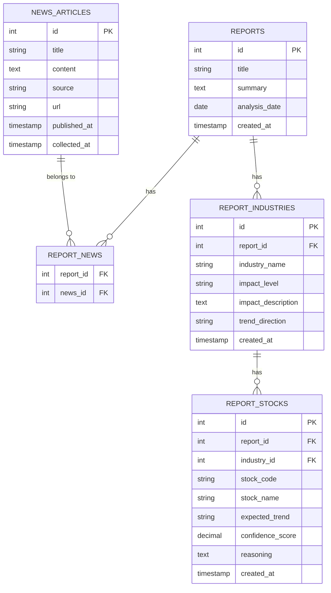
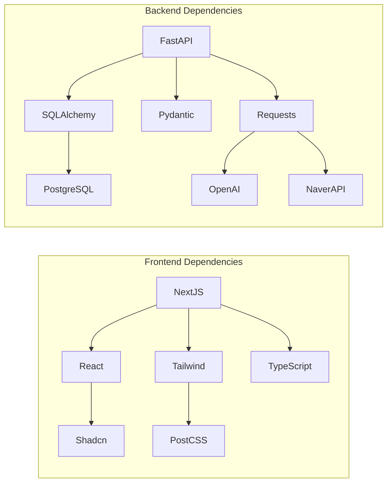

# 📊 프로젝트 아키텍처 다이어그램

이 문서는 뉴스 기반 주식 동향 분석 서비스의 전체 구조와 동작 방식을 시각적으로 설명합니다.

## 🏗 시스템 아키텍처

```mermaid
graph TB
    subgraph "Client Layer"
        User[사용자]
        Browser[웹 브라우저]
    end

    subgraph "Frontend Layer"
        NextJS[Next.js 15<br/>App Router]
        Pages[페이지 컴포넌트]
        Components[UI 컴포넌트]
        APIClient[API 클라이언트]
    end

    subgraph "Backend Layer"
        FastAPI[FastAPI 서버<br/>:8000]
        Routers[API 라우터]
        Services[비즈니스 로직]
    end

    subgraph "External APIs"
        NaverAPI[네이버 뉴스 API]
        OpenAIAPI[OpenAI API]
    end

    subgraph "Data Layer"
        PostgreSQL[(PostgreSQL<br/>데이터베이스)]
        Adminer[Adminer<br/>:8080]
    end

    User --> Browser
    Browser --> NextJS
    NextJS --> Pages
    Pages --> Components
    Components --> APIClient
    APIClient -->|HTTP/REST| FastAPI
    FastAPI --> Routers
    Routers --> Services
    Services -->|뉴스 수집| NaverAPI
    Services -->|AI 분석| OpenAIAPI
    Services -->|데이터 저장/조회| PostgreSQL
    Adminer -->|관리| PostgreSQL
```



## 🔄 데이터 흐름도

### 1. 뉴스 분석 요청 플로우

```mermaid
sequenceDiagram
    participant User as 사용자
    participant Frontend as Next.js Frontend
    participant Backend as FastAPI Backend
    participant Naver as 네이버 뉴스 API
    participant OpenAI as OpenAI API
    participant DB as PostgreSQL

    User->>Frontend: 분석 요청 (수동)
    Frontend->>Backend: POST /api/analyze
    Backend->>Backend: 날짜 검증 및 중복 확인

    alt 이미 분석된 날짜
        Backend-->>Frontend: 이미 존재하는 보고서 반환
    else 새로운 분석
        Backend->>Naver: 뉴스 검색 요청
        Naver-->>Backend: 뉴스 기사 목록
        Backend->>DB: 뉴스 기사 저장

        Backend->>OpenAI: 뉴스 분석 요청
        OpenAI-->>Backend: 분석 결과 (요약, 산업, 주식)

        Backend->>DB: 보고서 저장
        Backend->>DB: 산업 분석 저장
        Backend->>DB: 주식 분석 저장

        Backend-->>Frontend: 보고서 ID 반환
        Frontend-->>User: 분석 완료 표시
    end
```



### 2. 보고서 조회 플로우



## 📡 API 엔드포인트 구조

```mermaid
graph LR
    subgraph "FastAPI Server :8000"
        Root[/]
        Health[GET /api/health]
        Analyze[POST /api/analyze]
        ReportsToday[GET /api/reports/today]
        ReportDetail[GET /api/report/:id]
    end

    subgraph "Request/Response"
        AnalyzeReq[AnalyzeRequest<br/>- date: optional<br/>- query: string<br/>- count: number<br/>- force: boolean]
        AnalyzeRes[AnalyzeResponse<br/>- report_id<br/>- status<br/>- message<br/>- news_count]
        ReportList[ReportListItem[]<br/>- id, title, summary<br/>- analysis_date<br/>- news_count<br/>- industry_count]
        ReportDetailRes[ReportDetail<br/>- id, title, summary<br/>- news_articles[]<br/>- industries[]<br/>- stocks[]]
    end

    Analyze --> AnalyzeReq
    Analyze --> AnalyzeRes
    ReportsToday --> ReportList
    ReportDetail --> ReportDetailRes
```

## 🗄 데이터베이스 스키마



## 🎨 Frontend 컴포넌트 구조

```mermaid
graph TD
    subgraph "Pages"
        HomePage[/ - 홈페이지]
        ReportPage[/report/:id - 보고서 상세]
    end

    subgraph "Components"
        HeroSection[HeroSection<br/>Hero 섹션]
        TodayReports[TodayReports<br/>오늘의 보고서 목록]
        ReportCard[ReportCard<br/>보고서 카드]
        NewsList[NewsList<br/>뉴스 기사 리스트]
        IndustrySection[IndustrySection<br/>산업별 분석]
        StockCard[StockCard<br/>주식 카드]
    end

    subgraph "API Layer"
        ReportsAPI[lib/api/reports.ts<br/>- getTodayReports<br/>- getReport]
    end

    HomePage --> HeroSection
    HomePage --> TodayReports
    TodayReports --> ReportCard
    ReportPage --> NewsList
    ReportPage --> IndustrySection
    IndustrySection --> StockCard
    TodayReports --> ReportsAPI
    ReportPage --> ReportsAPI
```

## 🔧 기술 스택 상세

```mermaid
graph TB
    subgraph "Frontend"
        NextJS[Next.js 15]
        React[React 19]
        Tailwind[Tailwind CSS 4]
        TypeScript[TypeScript]
        Shadcn[shadcn/ui]
    end

    subgraph "Backend"
        FastAPI[FastAPI]
        SQLAlchemy[SQLAlchemy ORM]
        Pydantic[Pydantic]
        Python[Python 3.11+]
    end

    subgraph "Database"
        PostgreSQL[PostgreSQL 15]
        Adminer[Adminer]
    end

    subgraph "External Services"
        Naver[네이버 뉴스 API]
        OpenAI[OpenAI API]
    end

    subgraph "Infrastructure"
        Docker[Docker Compose]
        Network[Network Layer]
    end

    NextJS --> React
    NextJS --> Tailwind
    NextJS --> TypeScript
    NextJS --> Shadcn

    FastAPI --> SQLAlchemy
    FastAPI --> Pydantic
    FastAPI --> Python

    SQLAlchemy --> PostgreSQL
    Adminer --> PostgreSQL

    FastAPI --> Naver
    FastAPI --> OpenAI

    Docker --> NextJS
    Docker --> FastAPI
    Docker --> PostgreSQL
    Docker --> Adminer
```



## 📋 주요 기능 플로우

### 분석 프로세스 상세

```mermaid
flowchart TD
    Start([분석 요청 시작]) --> Validate{날짜 검증}
    Validate -->|유효하지 않음| Error1[에러 반환]
    Validate -->|유효함| Check{이미 분석됨?}

    Check -->|예, force=false| Return[기존 보고서 반환]
    Check -->|아니오 또는 force=true| Collect[뉴스 수집]

    Collect --> NaverAPI[네이버 API 호출]
    NaverAPI -->|성공| SaveNews[뉴스 DB 저장]
    NaverAPI -->|실패| Error2[에러 반환]

    SaveNews --> Analyze[AI 분석]
    Analyze --> OpenAI[OpenAI API 호출]
    OpenAI -->|성공| Parse[결과 파싱]
    OpenAI -->|실패| Error3[에러 반환]

    Parse --> SaveReport[보고서 저장]
    SaveReport --> SaveIndustries[산업 분석 저장]
    SaveIndustries --> SaveStocks[주식 분석 저장]
    SaveStocks --> Success[성공 응답]

    Error1 --> End([종료])
    Error2 --> End
    Error3 --> End
    Return --> End
    Success --> End
```



### 보고서 조회 프로세스


## 🌐 네트워크 아키텍처

```mermaid
graph TB
    subgraph "Docker Network"
        subgraph "Frontend Container"
            NextJS[Next.js :3000]
        end

        subgraph "Backend Container"
            FastAPI[FastAPI :8000]
        end

        subgraph "Database Container"
            PostgreSQL[PostgreSQL :5432]
        end

        subgraph "Admin Container"
            Adminer[Adminer :8080]
        end
    end

    subgraph "External Services"
        NaverAPI[네이버 API<br/>openapi.naver.com]
        OpenAIAPI[OpenAI API<br/>api.openai.com]
    end

    NextJS <-->|HTTP/REST| FastAPI
    FastAPI <-->|SQL| PostgreSQL
    Adminer <-->|SQL| PostgreSQL
    FastAPI <-->|HTTPS| NaverAPI
    FastAPI <-->|HTTPS| OpenAIAPI
```



## 📦 컴포넌트 의존성



## 🚀 배포 아키텍처 (현재: 로컬 개발)

```mermaid
graph TB
    subgraph "Local Development"
        Docker[Docker Compose]
        Docker --> Frontend[Frontend Container]
        Docker --> Backend[Backend Container]
        Docker --> DB[PostgreSQL Container]
        Docker --> Admin[Adminer Container]
    end

    subgraph "External APIs"
        Naver[네이버 뉴스 API]
        OpenAI[OpenAI API]
    end

    Backend --> Naver
    Backend --> OpenAI
    Backend --> DB
    Frontend --> Backend
    Admin --> DB
```



---

## 📝 다이어그램 설명

### 시스템 아키텍처

- 전체 시스템의 레이어 구조를 보여줍니다
- 클라이언트부터 데이터베이스까지의 흐름을 표현합니다

### 데이터 흐름도

- 시퀀스 다이어그램으로 요청-응답 플로우를 시각화합니다
- 분석 요청과 보고서 조회의 두 가지 주요 플로우를 다룹니다

### API 엔드포인트 구조

- FastAPI 서버의 주요 엔드포인트와 요청/응답 형식을 보여줍니다

### 데이터베이스 스키마

- ER 다이어그램으로 테이블 간 관계를 표현합니다
- 외래키와 관계를 명확히 표시합니다

### Frontend 컴포넌트 구조

- Next.js 페이지와 컴포넌트의 계층 구조를 보여줍니다
- 컴포넌트 간 의존성을 표현합니다

### 주요 기능 플로우

- 플로우차트로 비즈니스 로직의 실행 순서를 표현합니다
- 조건 분기와 에러 처리를 포함합니다

---

**참고**: 이 다이어그램들은 Mermaid 문법으로 작성되었으며, GitHub, GitLab, 또는 Mermaid를 지원하는 마크다운 뷰어에서 렌더링됩니다.
